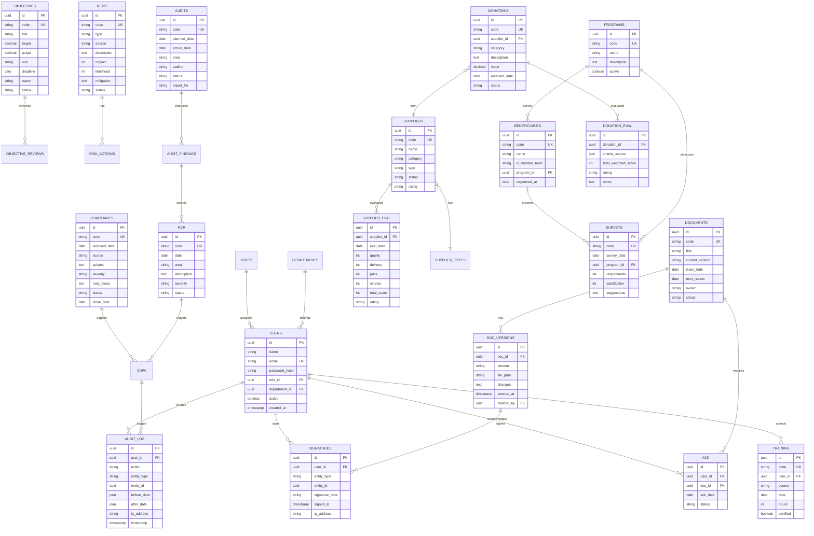

# 📐 الخطة المعمارية الكاملة لنظام إدارة الجودة الإلكتروني

**جمعية البر بمحافظة صبيا — Quality Management System (QMS)**

| البيان | القيمة |
|---|---|
| رمز الوثيقة | PLAN-001-2026 |
| الإصدار | 1.0 |
| تاريخ الإصدار | 2026/04/15 |
| المُعدّ | فريق التطوير + مسؤول الجودة |
| الحالة | مسودة للاعتماد |
| المرجعية | ISO 9001:2015 §7.5 (المعلومات الموثقة) |

---

## 1. الملخص التنفيذي (Executive Summary)

### 1.1 الغاية من النظام
بناء **نظام إلكتروني متكامل لإدارة الجودة** يُؤتمت جميع نماذج وسجلات نظام إدارة الجودة (QMS) في الجمعية، يُستضاف على البنية التحتية الخاصة بالجمعية (Self-Hosted)، ويفي بمتطلبات معيار ISO 9001:2015 من حيث ضبط المعلومات الموثقة والأدلة الموضوعية.

### 1.2 الأهداف الرئيسية
1. **رقمنة كاملة** لجميع نماذج الجودة الـ 30+ الموجودة في مجلد الجودة
2. **سجل تدقيق (Audit Trail)** لكل عملية — مطلب جوهري للمدقق الخارجي
3. **توقيع إلكتروني** للوثائق المعتمدة
4. **لوحات تحكم تنفيذية** بمؤشرات أداء حيّة
5. **تقارير PDF** احترافية فورية لأي نموذج
6. **نسخ احتياطي تلقائي** يومي
7. **إدارة صلاحيات** متعددة المستويات

### 1.3 الفائدة المتوقعة
- توفير 70% من وقت تعبئة النماذج وأرشفتها
- صفر فقدان بيانات (نسخ احتياطي تلقائي)
- جاهزية فورية لزيارات التدقيق الخارجي
- تتبع كامل لكل تعديل (من، متى، ماذا)
- وصول للبيانات من أي جهاز عبر المتصفح

---

## 2. المكدس التقني (Tech Stack)

### 2.1 الاختيار النهائي

| الطبقة | التقنية | الإصدار | السبب |
|---|---|---|---|
| **Frontend** | HTML5 + Tailwind CSS + Alpine.js | latest | RTL ممتاز، خفيف، لا يحتاج build معقد |
| **Charts** | Chart.js | 4.x | معياري، جميل، مدعوم |
| **Backend** | Node.js + Express.js | Node 20 LTS | شائع، خفيف، مجتمع قوي |
| **Database** | PostgreSQL | 16 | قوي، Audit Trail مدمج، مفتوح المصدر |
| **ORM** | Prisma | 5.x | type-safe، migrations ممتازة |
| **Authentication** | JWT + bcrypt + cookie sessions | - | معياري وآمن |
| **Validation** | Zod | 3.x | حماية من البيانات الخاطئة |
| **PDF Generation** | Puppeteer | 22 | يحوّل HTML إلى PDF بجودة ممتازة |
| **Excel Export** | ExcelJS | 4.x | تصدير سجلات Excel |
| **E-Signature** | SignaturePad.js | 5.x | توقيع بالماوس/اللمس |
| **File Upload** | Multer + S3-compatible | - | للمرفقات (شهادات، صور) |
| **Containerization** | Docker + Docker Compose | 24+ | معياري، يعمل مع Coolify |
| **Reverse Proxy** | Coolify Built-in (Traefik) | - | تلقائي |
| **SSL** | Let's Encrypt (عبر Coolify) | - | مجاني وتلقائي |
| **CI/CD** | GitHub + Coolify Webhook | - | Push → Auto Deploy |
| **Monitoring** | Coolify Built-in + Sentry (اختياري) | - | مراقبة الأخطاء |

### 2.2 لماذا هذا الاختيار؟

**Node.js + Express:** بدلاً من Python أو PHP، لأن JavaScript واحد للـ frontend والـ backend = صيانة أسهل + مكتبات وفيرة + أداء ممتاز للنماذج التفاعلية.

**PostgreSQL:** بدلاً من MySQL، لأنه يدعم:
- JSON columns (للنماذج المرنة)
- Triggers قوية للـ Audit Trail
- Row Level Security (للصلاحيات)
- Full-text search عربي

**Prisma ORM:** بدلاً من SQL خام، لأنه:
- Type-safe (يمنع 80% من الأخطاء)
- Migrations آلية
- Schema واحد للقاعدة والكود

**HTML + Alpine.js بدلاً من React:** لأن:
- لا يحتاج build خطوة (نشر فوري)
- صغير الحجم (10KB)
- سهل التعديل لأي مطور لاحقاً
- مثالي لـ 10 مستخدمين (لا حاجة لـ React الثقيل)

---

## 3. المعمارية المعلوماتية (System Architecture)

### 3.1 الهيكل العام

```
┌──────────────────────────────────────────────────────────────┐
│                     المستخدمون (لجنة الجودة)                  │
│              متصفح ويب • جوال • تابلت                        │
└────────────────────────┬─────────────────────────────────────┘
                         │ HTTPS
                         ▼
┌──────────────────────────────────────────────────────────────┐
│  💎 Coolify Server (بنية الجمعية التحتية)                     │
│  ┌────────────────────────────────────────────────────────┐  │
│  │  🌐 Traefik (Reverse Proxy + SSL تلقائي)               │  │
│  └─────────────┬──────────────────────────┬───────────────┘  │
│                │                          │                   │
│   ┌────────────▼────────┐    ┌────────────▼────────┐         │
│   │  📦 QMS-WEB         │    │  📦 QMS-API          │         │
│   │  (Frontend Static)  │    │  (Node.js + Express) │         │
│   │  Tailwind + Alpine  │◄──►│  REST API + JWT      │         │
│   │  Port: 8080         │    │  Port: 3000          │         │
│   └─────────────────────┘    └──────────┬───────────┘         │
│                                          │                    │
│                         ┌────────────────▼──────────────┐    │
│                         │  📦 QMS-DB (PostgreSQL 16)    │    │
│                         │  - 20+ tables                 │    │
│                         │  - Audit triggers             │    │
│                         │  - Daily backup (pg_dump)     │    │
│                         └────────────────┬──────────────┘    │
│                                          │                    │
│                         ┌────────────────▼──────────────┐    │
│                         │  📁 Volumes                   │    │
│                         │  - DB data                    │    │
│                         │  - Uploaded files             │    │
│                         │  - Backups                    │    │
│                         └───────────────────────────────┘    │
└──────────────────────────────────────────────────────────────┘
                         │
                         ▼
              ┌──────────────────────┐
              │  📂 GitHub Private   │
              │  - Source code       │
              │  - Webhook to Coolify│
              └──────────────────────┘

سير العمل: git push → GitHub webhook → Coolify pulls & rebuilds
```

### 3.2 خدمات Docker Compose

```yaml
services:
  qms-web:        # Frontend static (Nginx serves HTML/JS)
  qms-api:        # Backend Node.js Express
  qms-db:         # PostgreSQL 16
  qms-backup:     # Cron job for daily pg_dump
```

---

## 4. مخطط قاعدة البيانات (ER Diagram)



---

## 5. الوحدات الوظيفية (Functional Modules)

### 5.1 الوحدات الأساسية (15 وحدة)

| # | الوحدة | البند ISO | الأولوية |
|---|---|---|---|
| 1 | **إدارة المستخدمين والصلاحيات** | 5.3 | 🔴 حرجة |
| 2 | **لوحة التحكم التنفيذية** | 9.1 | 🔴 حرجة |
| 3 | **أهداف الجودة** | 6.2 | 🔴 حرجة |
| 4 | **المخاطر والفرص** | 6.1 | 🔴 حرجة |
| 5 | **الشكاوى والإجراءات التصحيحية** | 9.1.2 / 10.2 | 🔴 حرجة |
| 6 | **عدم المطابقة (NCR)** | 8.7 / 10.2 | 🔴 حرجة |
| 7 | **التدقيق الداخلي** | 9.2 | 🔴 حرجة |
| 8 | **مراجعة الإدارة** | 9.3 | 🟡 مهمة |
| 9 | **الموردون والتقييم (4 أنواع)** | 8.4 | 🔴 حرجة |
| 10 | **التبرعات العينية** | 8.4 | 🟡 مهمة |
| 11 | **المستفيدون والاستبيانات** | 9.1.2 | 🟡 مهمة |
| 12 | **التدريب والكفاءات** | 7.2 | 🟡 مهمة |
| 13 | **ضبط الوثائق والإصدارات** | 7.5 | 🔴 حرجة |
| 14 | **اطلاع الموظفين والتوقيع** | 7.3 | 🟡 مهمة |
| 15 | **التقارير والتحليلات** | 9.1 | 🟡 مهمة |

### 5.2 الوحدات الإضافية (المرحلة الثانية)
- إدارة المتطوعين والشكر
- إدارة التبرعات النقدية والمتبرعين
- نظام الإشعارات (إيميل + داخلي)
- تطبيق جوال (PWA)
- الذكاء الاصطناعي للتحليل التنبؤي

---

## 6. تصميم الـ API (REST Endpoints)

### 6.1 نمط الـ Endpoints

```
GET    /api/{module}              # قائمة كل السجلات
GET    /api/{module}/:id          # سجل واحد
POST   /api/{module}              # إضافة جديد
PUT    /api/{module}/:id          # تعديل
DELETE /api/{module}/:id          # حذف (soft delete)
GET    /api/{module}/:id/history  # تاريخ التعديلات
POST   /api/{module}/:id/sign     # توقيع إلكتروني
GET    /api/{module}/:id/pdf      # تصدير PDF
```

### 6.2 أمثلة عملية

```
POST   /api/auth/login
POST   /api/auth/logout
GET    /api/auth/me

GET    /api/dashboard/health-score
GET    /api/dashboard/kpis
GET    /api/dashboard/alerts

GET    /api/risks
POST   /api/risks
PUT    /api/risks/:id
GET    /api/risks/matrix          # مصفوفة المخاطر

POST   /api/complaints/:id/capa   # ربط إجراء تصحيحي

GET    /api/audits/plan/:year     # خطة التدقيق السنوية
POST   /api/audits/:id/findings   # إضافة نتائج التدقيق

POST   /api/donations/:id/evaluate
GET    /api/suppliers/by-rating/:rating

GET    /api/documents/:id/versions
POST   /api/documents/:id/acknowledge
GET    /api/users/:id/pending-acks

GET    /api/reports/audit-trail   # سجل التدقيق الكامل
GET    /api/reports/management-review/:year
```

---

## 7. نموذج الأمان والصلاحيات (Security Model)

### 7.1 الأدوار (Roles)

| الدور | الصلاحيات |
|---|---|
| **Super Admin** | كل شيء + إدارة المستخدمين + الإعدادات |
| **مدير الجودة** | كل وحدات الجودة + إنشاء/تعديل/حذف + الموافقات |
| **عضو لجنة الجودة** | إنشاء + تعديل + قراءة (بدون حذف) |
| **مسؤول قسم** | بياناته فقط + قراءة عامة |
| **موظف** | استبيانات + اطلاع + قراءة مخصصة |
| **مدقق ضيف** | قراءة فقط للسجلات المعتمدة (لزيارة التدقيق) |

### 7.2 طبقات الأمان

1. **HTTPS إجباري** (Coolify يدير SSL تلقائياً)
2. **JWT Tokens** بصلاحية 8 ساعات
3. **Refresh Tokens** بصلاحية 30 يوم
4. **bcrypt** لتشفير كلمات المرور (cost factor 12)
5. **Rate Limiting** على endpoints حساسة
6. **CSRF Protection**
7. **SQL Injection Protection** (عبر Prisma)
8. **XSS Protection** (تنظيف المدخلات)
9. **2FA اختياري** للحسابات الإدارية (مرحلة 2)
10. **IP Whitelisting** للوحدات الحساسة (اختياري)

### 7.3 سجل التدقيق (Audit Trail)

كل عملية تُسجَّل تلقائياً في جدول `audit_log`:
- المستخدم
- الإجراء (CREATE/UPDATE/DELETE/SIGN/EXPORT)
- نوع الكيان والمعرّف
- البيانات قبل وبعد (JSON diff)
- IP Address
- Timestamp بدقة الميلي ثانية

**هذا الجدول لا يُحذف منه أبداً ولا يُعدَّل** — مطلب جوهري لـ ISO.

---

## 8. النشر على Coolify (Deployment Workflow)

### 8.1 سير العمل المتكامل

```
1. تطوير محلي (VS Code)
   ↓
2. git commit + git push origin main
   ↓
3. GitHub Webhook → Coolify
   ↓
4. Coolify يقوم بـ:
   ├─ git pull آخر تحديث
   ├─ docker compose build
   ├─ docker compose up -d
   ├─ تشغيل migrations تلقائياً
   ├─ Health check
   └─ تحديث Traefik + SSL
   ↓
5. النظام محدّث على quality.bir-sabia.org.sa
```

### 8.2 إعدادات Coolify المطلوبة

| الإعداد | القيمة |
|---|---|
| Source | GitHub Private Repo |
| Build Pack | Docker Compose |
| Domain | quality.bir-sabia.org.sa |
| SSL | Let's Encrypt تلقائي |
| Auto Deploy | عند push على main |
| Health Check | GET /api/health |
| Backup | يومي 3 صباحاً |
| Backup Retention | 30 يوم |

### 8.3 متغيرات البيئة (Environment Variables)

```env
DATABASE_URL=postgresql://...
JWT_SECRET=<64-char-random>
SESSION_SECRET=<64-char-random>
SMTP_HOST=...
SMTP_USER=...
APP_URL=https://quality.bir-sabia.org.sa
NODE_ENV=production
```

---

## 9. مراحل التنفيذ (Project Phases)

### المرحلة 0: التحضير (3 أيام)
- [ ] إنشاء حساب GitHub للجمعية (أو استخدام الشخصي مؤقتاً)
- [ ] إنشاء Private Repo
- [ ] ضبط Coolify على السيرفر
- [ ] حجز Subdomain `quality.bir-sabia.org.sa`
- [ ] اعتماد هذه الخطة المعمارية

### المرحلة 1: الأساس والبنية التحتية (أسبوع 1)
- [ ] هيكل المشروع (Backend + Frontend)
- [ ] قاعدة البيانات + Migrations + Seeds
- [ ] نظام المصادقة (Login/Logout/JWT)
- [ ] إدارة المستخدمين والأدوار
- [ ] لوحة التحكم الأساسية
- [ ] Audit Trail تلقائي (Triggers)
- [ ] Docker + Compose + .env.example
- [ ] أول نشر على Coolify (Hello World)

### المرحلة 2: الوحدات الحرجة (أسبوع 2-3)
- [ ] أهداف الجودة (CRUD + Charts)
- [ ] المخاطر والفرص + مصفوفة 5×5
- [ ] الشكاوى + CAPA
- [ ] عدم المطابقة (NCR)
- [ ] التدقيق الداخلي
- [ ] الموردون (4 أنواع) + التقييم
- [ ] ضبط الوثائق + الإصدارات
- [ ] التوقيع الإلكتروني (SignaturePad)

### المرحلة 3: الوحدات المهمة (أسبوع 4)
- [ ] التبرعات العينية + التقييم
- [ ] المستفيدون والاستبيانات
- [ ] التدريب والكفاءات
- [ ] اطلاع الموظفين
- [ ] مراجعة الإدارة

### المرحلة 4: التقارير والتصدير (أسبوع 5)
- [ ] تصدير PDF لكل نموذج
- [ ] تصدير Excel للسجلات
- [ ] تقارير دورية تلقائية
- [ ] تقرير سجل التدقيق
- [ ] طباعة احترافية

### المرحلة 5: الجودة والاختبار (أسبوع 6)
- [ ] اختبار شامل (Manual + Automated)
- [ ] اختبار الأمان (Security Audit)
- [ ] اختبار الأداء
- [ ] تدريب لجنة الجودة
- [ ] دليل المستخدم
- [ ] دليل الإدارة التقنية

### المرحلة 6: الإطلاق (أسبوع 7)
- [ ] استيراد البيانات الموجودة (إن وجدت)
- [ ] إنشاء الحسابات
- [ ] التشغيل الفعلي
- [ ] متابعة أسبوع كامل
- [ ] تسليم نهائي

**📅 الإجمالي المتوقع: 6-7 أسابيع للنسخة الأولى الكاملة**

---

## 10. هيكل المشروع (Repository Structure)

```
qms-bir-sabia/
├── .github/
│   └── workflows/          # GitHub Actions (اختياري)
├── apps/
│   ├── web/                # Frontend
│   │   ├── public/
│   │   ├── src/
│   │   │   ├── pages/      # كل وحدة صفحة
│   │   │   ├── components/ # مكونات مشتركة
│   │   │   ├── lib/        # API client + helpers
│   │   │   └── styles/
│   │   ├── Dockerfile
│   │   └── package.json
│   └── api/                # Backend
│       ├── src/
│       │   ├── routes/     # كل وحدة Router
│       │   ├── controllers/
│       │   ├── services/
│       │   ├── middleware/ # Auth, Audit, Errors
│       │   ├── prisma/
│       │   │   ├── schema.prisma
│       │   │   ├── migrations/
│       │   │   └── seed.ts
│       │   └── utils/
│       ├── Dockerfile
│       └── package.json
├── docker-compose.yml      # Production
├── docker-compose.dev.yml  # Development
├── .env.example
├── .gitignore
├── README.md
├── DEPLOYMENT.md           # دليل النشر
├── USER_GUIDE.md           # دليل المستخدم
└── ADMIN_GUIDE.md          # دليل المسؤول التقني
```

---

## 11. الميزانية والموارد

### 11.1 التكلفة المالية
| البند | التكلفة |
|---|---|
| الاستضافة | ✅ مدفوع (السيرفر الحالي) |
| النطاق الفرعي | ✅ مجاني (تحت bir-sabia.org.sa) |
| GitHub Repo | ✅ مجاني (Private للحساب الشخصي) |
| Coolify | ✅ مفتوح المصدر |
| SSL | ✅ مجاني (Let's Encrypt) |
| قاعدة البيانات | ✅ PostgreSQL مجاني |
| **الإجمالي** | **0 ريال** 🎉 |

### 11.2 الموارد البشرية المطلوبة من الجمعية
- مسؤول جودة: مراجعة + قبول + اختبار (5 ساعات/أسبوع)
- شخص تقني: متابعة Coolify + GitHub (1 ساعة/أسبوع)
- لجنة الجودة: تدريب وتغذية راجعة (3 ساعات إجمالاً)

---

## 12. مؤشرات نجاح المشروع (KPIs)

عند الإطلاق، سنقيس:
1. ✅ تعبئة 100% من نماذج الجودة في النظام
2. ✅ زمن استخراج تقرير = أقل من 30 ثانية
3. ✅ صفر فقدان بيانات (نسخ احتياطي ناجح يومياً)
4. ✅ 100% من لجنة الجودة دخلت النظام مرة واحدة على الأقل
5. ✅ اعتماد المدقق الخارجي للنظام كمعلومات موثقة

---

## 13. المخاطر وخطة التخفيف

| الخطر | الاحتمالية | الأثر | المعالجة |
|---|---|---|---|
| فشل النشر على Coolify | منخفضة | متوسط | اختبار محلي قبل النشر + rollback سهل |
| فقدان بيانات | منخفضة | عالي | نسخ احتياطي يومي + اختبار استعادة شهري |
| اختراق أمني | منخفضة | عالي | HTTPS + JWT + bcrypt + Rate limiting + 2FA |
| مقاومة المستخدمين | متوسطة | متوسط | تدريب + دليل + دعم أسبوعين |
| تأخر التنفيذ | متوسطة | منخفض | مراحل واضحة + MVP في 3 أسابيع |

---

## 14. الخطوات التالية

### إجراءات مطلوبة منكم قبل البدء في البناء:

| # | الإجراء | المسؤول | الموعد |
|---|---|---|---|
| 1 | اعتماد هذه الخطة | مسؤول الجودة + الإدارة | فوري |
| 2 | إنشاء Private Repo على GitHub | المسؤول التقني | يوم 1 |
| 3 | تجهيز Subdomain `quality.bir-sabia.org.sa` | المسؤول التقني | يوم 1 |
| 4 | تجهيز مشروع جديد على Coolify | المسؤول التقني | يوم 2 |
| 5 | تأكيد قائمة لجنة الجودة (الأسماء + الإيميلات) | مسؤول الجودة | يوم 2 |
| 6 | تأكيد شعار الجمعية + الألوان الرسمية | مسؤول الجودة | يوم 3 |
| 7 | ⭐ **إعطاء الإشارة للبدء في البناء** | المدير التنفيذي | يوم 3 |

---

## 15. سجل التغييرات

| الإصدار | التاريخ | التعديل | المعتمد |
|---|---|---|---|
| 1.0 | 2026/04/15 | الإصدار الأول من الخطة | - |

---

## 📌 خاتمة

هذه الخطة تمثل **خارطة طريق احترافية** لبناء نظام إدارة جودة إلكتروني يخدم الجمعية لسنوات، يفي بمتطلبات ISO 9001:2015، ويُبنى على بنية تحتية مملوكة لكم 100%، بدون أي تكلفة شهرية.

**قرارك الآن مطلوب على:**
1. ✅ اعتماد هذه الخطة كما هي
2. 🔄 طلب تعديلات/إضافات
3. ❓ مناقشة جزء معين

عند الاعتماد، نبدأ المرحلة 0 ثم الانتقال للبناء الفعلي.

---
*وثيقة معتمدة بموجب نظام إدارة الجودة — جمعية البر بمحافظة صبيا*
